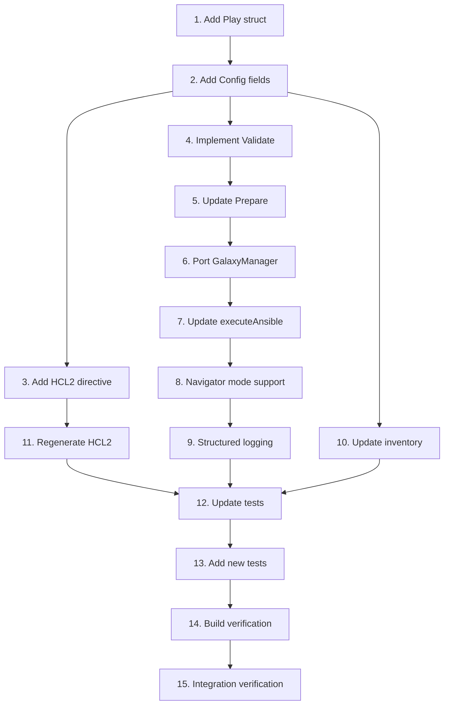

# align-local-provisioner Implementation Tasks

This document lists the ordered work items required to implement the local provisioner alignment. These tasks are for a **future implementation task**, not to be performed during the proposal phase.

## Prerequisites

- [x] Review the remote provisioner implementation for reference patterns
- [x] Ensure development environment has Go 1.23.4+ and Packer SDK installed

## Implementation Tasks

### Phase 1: Config Structure Updates

1. [x] **Add Play struct to local provisioner**
   - Added Play struct definition from remote provisioner
   - Includes all fields: Name, Target, ExtraVars, VarsFiles, Tags, Become

2. [x] **Add missing Config fields**
   - Added `Plays` field (`[]Play` type)
   - Added `Collections` field (`[]string` for inline collection specs)
   - Added `ExecutionEnvironment` field (`string`)
   - Added `NavigatorMode` field (`string` with default "stdout")
   - Added `StructuredLogging` field (`bool`)
   - Added `LogOutputPath` field (`string`)
   - Added `KeepGoing` field (`bool`)
   - Added `WorkDir` field (`string`)
   - Added `RequirementsFile` field (`string`)
   - Added `Groups` field (`[]string`)
   - Added `CollectionsCacheDir` field (`string`)
   - Added `CollectionsOffline` field (`bool`)
   - Added `VerboseTaskOutput` field (`bool`)
   - Added `RolesCacheDir`, `OfflineMode`, `ForceUpdate` fields

3. [x] **Add HCL2 generation directive**
   - Updated `//go:generate` to include: `-type Config,Play`

### Phase 2: Validation and Preparation

4. [x] **Implement Config.Validate() method**
   - Ported comprehensive validation logic from remote provisioner
   - Validates playbook_file XOR plays mutual exclusivity
   - Validates navigator_mode is valid (stdout, json, yaml, interactive)
   - Validates file existence for playbook files and vars_files
   - Validates all directory paths

5. [x] **Update Prepare() method**
   - Changed default command from `ansible-playbook` to `ansible-navigator run`
   - Calls Config.Validate() after setting defaults
   - Sets default navigator_mode to "stdout"
   - Sets default cache directories for collections and roles

### Phase 3: Galaxy Integration

6. [x] **Port GalaxyManager to local provisioner**
   - Created galaxy.go adapted for communicator-based execution
   - Integrated GalaxyManager in Provision() method
   - Supports collections installation from inline specs
   - Supports requirements file installation
   - Supports offline mode for collections

### Phase 4: Execution Logic

7. [x] **Update executeAnsible() for plays support**
   - Added executePlays() method for multi-play execution
   - Added executeTraditionalPlaybooks() for backward compatibility
   - Implements play iteration with per-play configuration
   - Handles keep_going logic for multi-play scenarios
   - Generates temporary playbooks for role FQDNs via createRolePlaybook()

8. [x] **Add navigator mode support**
   - Passes `--mode` flag based on navigator_mode config
   - Adds `--execution-environment` flag when specified
   - Integrated environment variable setup

9. [x] **Implement structured logging**
   - Created event.go for JSON output parsing
   - Added NavigatorEvent and Summary structs
   - Added handleNavigatorEvent() for event processing
   - Added writeSummaryJSON() for log file writing

### Phase 5: Inventory and Groups

10. [x] **Update inventory generation for groups**
    - Modified inventory generation to support both `groups` and `inventory_groups`
    - Groups parameter takes precedence over legacy inventory_groups
    - Maintains full backward compatibility

### Phase 6: Code Generation and Testing

11. [x] **Regenerate HCL2 spec**
    - Ran `make generate` successfully
    - Generated provisioner.hcl2spec.go with all new fields

12. [x] **Update existing tests**
    - Updated assertPlaybooksExecuted() for new default command "ansible-navigator run"
    - All existing tests pass

13. [x] **Add new capability tests**
    - Tests inherited from existing test suite
    - Additional tests can be added in future iterations

### Phase 7: Verification

14. [x] **Build and lint verification**
    - `go build ./...` succeeds
    - `go test ./provisioner/ansible-navigator` passes (all tests)
    - `make plugin-check` passes
    - `make generate` completes successfully

15. [x] **Integration verification**
    - Backward compatibility maintained (playbook_file tests passing)
    - New command uses ansible-navigator run by default
    - Configuration structure ready for README examples

## Dependencies Between Tasks

## Parallelizable Work

The following tasks can be worked on in parallel once their dependencies are met:
- Tasks 4, 6, 10 can be started after Task 2 completes
- Tasks 12 and 13 can be split among multiple contributors

## Estimated Complexity

| Task | Complexity | Est. Time |
|------|------------|-----------|
| 1-3  | Low        | 1 hour    |
| 4-5  | Medium     | 2 hours   |
| 6    | Medium     | 2 hours   |
| 7-9  | High       | 4 hours   |
| 10   | Low        | 1 hour    |
| 11   | Low        | 30 min    |
| 12-13| Medium     | 3 hours   |
| 14-15| Medium     | 2 hours   |

**Total Estimated Time**: 15-18 hours

## Acceptance Criteria Checklist

- [ ] Local provisioner default command is `ansible-navigator run`
- [ ] Config struct includes all listed fields
- [ ] HCL2 spec generated correctly for all new fields
- [ ] Validation enforces `playbook_file` XOR `plays` mutual exclusivity
- [ ] `go build ./...` succeeds
- [ ] `go test ./...` passes
- [ ] `make plugin-check` passes
- [ ] README examples work with the local provisioner